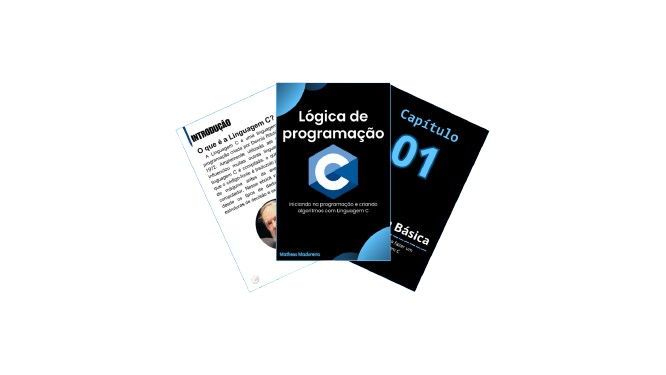

    

-------

# Projeto EBOOK Gerado por I.A.s

 > ℹ️ **NOTE:** Este é o repositório desenvolvido durante o curso do Santander da plataforma da [DIO](https://dio.me)

Projeto com o objetivo de gerar um ebook digital com as facilidades das ferramentas de IA.

<a href="https://github.com/MatheusMadureiraa/prompts-recipe-to-create-a-ebook-SantanderBootcamp/blob/main/Ebook%20-%20L%C3%B3gica%20em%20C.pdf" title="View Ebook"> 📕Clique para ler</a>

## 💻 Tecnologias utilizadas para realizar o projeto:

- [ChatGPT](https://chat.openai.com/) 
- [MidJourney](https://www.midjourney.com/app/)
- [Copilot](https://copilot.microsoft.com/)
- [PowerPoint](https://www.microsoft.com/en/microsoft-365/powerpoint)

## 🧠 Prompts:

ChatGPT e Copilot：

|   Ação   | prompt                                                                                                                                                                                                                                                                         |
| :------: | ------------------------------------------------------------------------------------------------------------------------------------------------------------------------------------------------------------------------------------------------------------------------------ |
|  título  | Crie um título para um ebook com o tema de "Introdução a programação com linguagem C" O título do ebook deve ser inspirado em uma temática simples e cativante, voltado para o nicho de programação.                                                 |
| conteúdo | Faça um texto para um capíitulo de ebook sobre Lógica de Programação em Linguagem C, introduzindo a linguagem C e listando as principais ferramentas usadas em algoritmos, dê exemplos com códigos, explicando-os em seguida. Siga as {REGRAS} para desenvolver o texto.{REGRAS}:- Explique de maneira simples, como se fosse para um leigo em programação- Deixe o texto enxuto/pequeno- Traga sempre exemplos de códigos em contextos reais- Sempre deixe um título sugestivo por tópico criado- Crie os capítulos numerando-os |

Midjourney e Copilot：

|  Ação  | prompt                                                                                 |
| :----: | -------------------------------------------------------------------------------------- |
| título | A C language program logo in the center of the screen, with dark background, minimalist blue margin details, clean and simple image |

## ✨ Features

- Conteúdo gerado via ChatGPT e Copilot
- Imagens geradas via MidJourney e Copilot

## 📚 Materiais

- Imagens utilizadas disponíveis na pasta `assets`
- ebook gerado durante as aulas disponível em `Ebook - Lógica em C.pdf`

## 🛠️ Instruções de execução

Utilize os prompts acima nas ferramentas sugeridas para gerar o material base e utilize uma ferramenta de edição de documentos como power point, libreoffice , indesign para diagramação.
